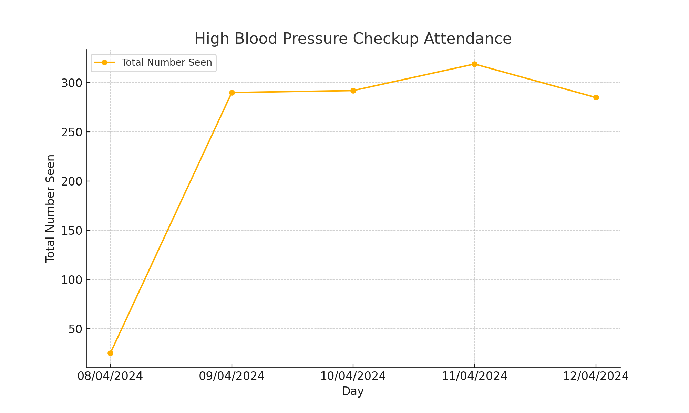
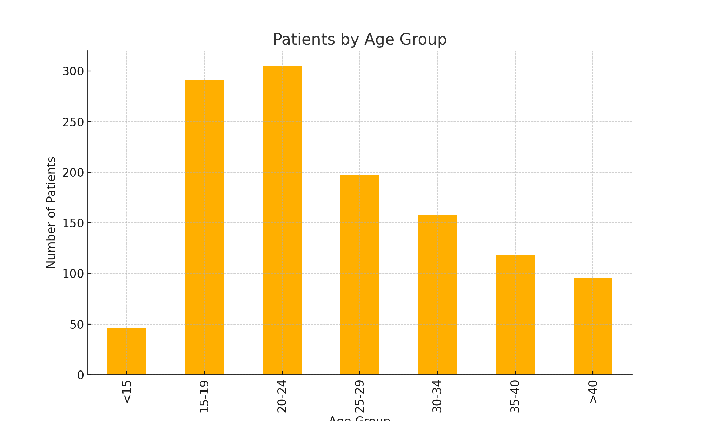
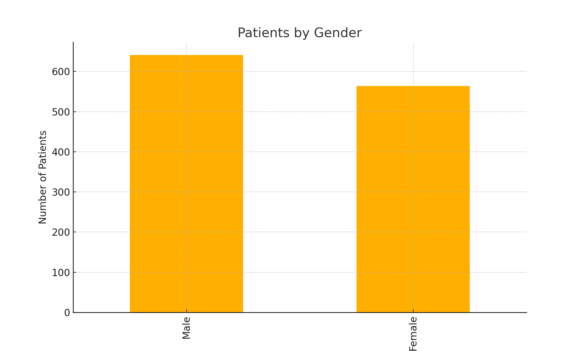

# High Blood Pressure Checkup Analysis

This project analyzes data from a 5-day free high blood pressure checkup event at National Hospital Abuja.

## Data

The data is provided in `checkup_data.csv`. It contains the following columns:
- `Day`: The date of the checkup.
- `Total Number Seen`: The total number of patients seen.
- `<15`: Number of patients under 15 years old.
- `15-19`: Number of patients between 15 and 19 years old.
- `20-24`: Number of patients between 20 and 24 years old.
- `25-29`: Number of patients between 25 and 29 years old.
- `30-34`: Number of patients between 30 and 34 years old.
- `35-40`: Number of patients between 35 and 40 years old.
- `>40`: Number of patients over 40 years old.
- `Male`: Number of male patients.
- `Female`: Number of female patients.

## Analysis

The analysis is performed using a Python script `analysis.py`. It includes:
- Basic descriptive statistics of the dataset.
- Visualization of the total number of patients seen each day.
- Breakdown of patient numbers by age group and gender.

### Summary of the Data

The table below shows the summary statistics of the dataset:

| Statistic | Total Number Seen | <15 | 15-19 | 20-24 | 25-29 | 30-34 | 35-40 | >40 | Male | Female |
|-----------|--------------------|-----|-------|-------|-------|-------|-------|-----|------|--------|
| Count     | 5                  | 5   | 5     | 5     | 5     | 5     | 5     | 5   | 5    | 5      |
| Mean      | 242.2              | 9.2 | 58.2  | 61    | 39.4  | 31.6  | 23.6  | 19.2| 128.2| 112.8  |
| Std Dev   | 124.8              | 5.1 | 29.5  | 29.1  | 19.1  | 18.2  | 12.9  | 12.7| 64.5 | 61.9   |
| Min       | 25                 | 2   | 9     | 5     | 4     | 1     | 1     | 3   | 17   | 8      |
| Max       | 319                | 14  | 81    | 84    | 57    | 44    | 38    | 34  | 170  | 149    |

### Visualization

#### Total Number of Patients Seen Each Day



This graph shows the total number of patients seen each day during the 5-day event.

#### Breakdown by Age Group and Gender

You can include additional graphs showing the breakdown of patient numbers by age group and gender. For example:

**Patients by Age Group:**



**Patients by Gender:**



## How to Run

1. Ensure you have Python and the necessary libraries installed. You can install the required libraries using:

    ```bash
    pip install pandas matplotlib
    ```

2. Run the script using:

    ```bash
    python analysis.py
    ```

The script will output a summary of the data and generate plots saved as `attendance_plot.png`, `age_group_plot.png`, and `gender_plot.png`.

## Repository Structure

- `checkup_data.csv`: The dataset.
- `analysis.py`: The Python script that performs the data analysis.
- `attendance_plot.png`: Plot of the total number of patients seen each day.
- `age_group_plot.png`: Plot of the number of patients by age group.
- `gender_plot.png`: Plot of the number of patients by gender.

## Contributions

Contributions are welcome! Please create an issue or submit a pull request if you would like to contribute to this project.

## License

This project is licensed under the MIT License.
